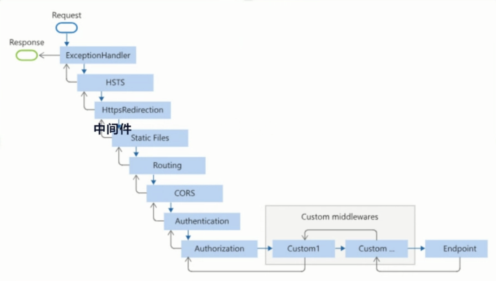

## How to create a solution with different projects with VSCode

- `mkdir SolutionName`
- `cd SolutionName`
- `dotnet new sln -n SolutionName`
- `dotnet new console -n Project1`
- `dotnet sln add Project1/Project1.csproj`

## How to configure run debug in VSCode

### Configure .vscode/launch.json
Can setup multiple project run configurations
### Configure .vscode/task.json
`lable` of the task must be identical with `preLaunchTask` in launch.json

In `Run and Debug` panel, select a project from the dropdown menu.

## WebApi

### Difference btw `WebApi` `WebApi2` & `WebApplication1`

`WebApi` is created using traditional `Main` instead of `top-level statements`
`dotnet new webapi -n WebApi --use-program-main`

`WebApi2` is created using controllers
`dotnet new webapi --use-controllers -o WebApi2`

`WebApplication1` is created using VSCode UI
by default `top-level statements` 

### Middleware

It is different than NodeJS. For example, NodeJS put the error handle middleware at the end. The order is dependent on languages.

#### MapControllers()
Find the controller according to a user request

### Parameters
#### Route Parameters
If attribute has an `[action]`, the request url has to include the handler name `api/weatherforecast/getweatherforcast/1`
If attribute doesn't have an `[action]`, the request url is just `api/weatherforecast/1`

```csharp
    [Route("api/[controller]/[action]")]
    ...
    [HttpGet("{id}")]
    // api/weatherforecast/getweatherforcast/1
    public WeatherForecast GetWeatherForecast(int id)
    {
        var weatherArr = Enumerable.Range(1, 5).Select(index => new WeatherForecast
        {
            Date = DateOnly.FromDateTime(DateTime.Now.AddDays(index)),
            TemperatureC = Random.Shared.Next(-20, 55),
            Summary = Summaries[Random.Shared.Next(Summaries.Length)]
        })
        .ToArray();

        if (id < 0 || id >= weatherArr.Length)
        {
            throw new ArgumentOutOfRangeException(nameof(id), "Invalid weather forecast ID.");
        }
        
        return weatherArr[id];
    }
```

#### Query String Parameters
`api/WeatherForecast/QueryStringParameters?id=1&name=diana`
```csharp
[HttpGet]
public string QueryStringParameters(int id, string name)
{   
    return name;
}
```

#### Request Body Parameters for post

```csharp
[HttpPost]
// body - raw
public JsonResult AddUser([FromBody] User user){
    return new JsonResult(user);
}

[HttpPost]
// form-data: mimic html form submit
public JsonResult AddUserFromForm([FromForm] User user){
    return new JsonResult(user);
}
```

### Model Validation
.NET built-in model validation before going into the handler
Return a built-in format result
```csharp
[Required]
...
```

If we want to customize the return result
built-in model validation can be disabled by
```csharp
builder.Services.Configure<ApiBehaviorOptions>(options=>options.SupressModelStateInvalidFilter = true);
```